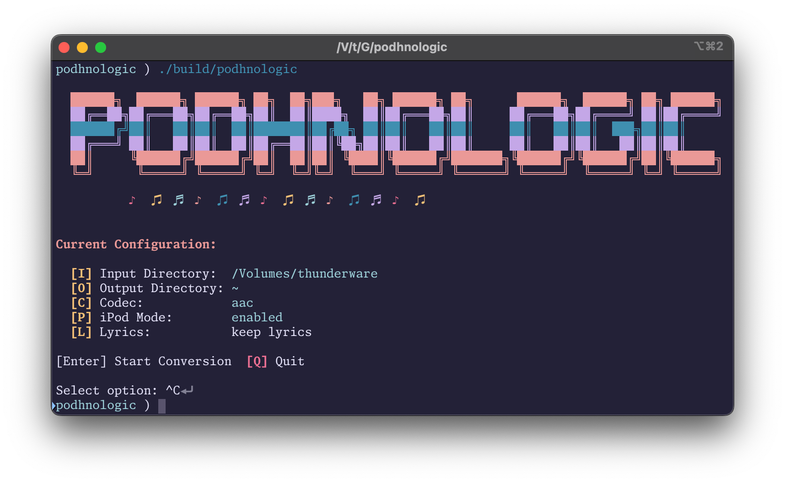

<p align="center" >
  <b>podhnologic</b><br/>
  Convert your music collection to another format; e.g. iPod
<br/><br />
  
</p>

# ✨ Version 4.0 - The Ultimate Music Converter!

**Self-contained music format converter with embedded FFmpeg. Zero dependencies.**

- Terminal UI with keyboard shortcuts
- FFmpeg embedded - no installation needed
- Multi-threaded conversion using all CPU cores
- Resumable - skips already converted files
- iPod optimized conversions



## Quick Start

### 1. Download

Get the latest binary from [Releases](https://github.com/jmonster/podhnologic/releases):

| Platform | Download |
|----------|----------|
| **macOS (Apple Silicon)** | `podhnologic-darwin-arm64` |
| **macOS (Intel)** | `podhnologic-darwin-amd64` |
| **Windows** | `podhnologic-windows-amd64.exe` |
| **Linux (x64)** | `podhnologic-linux-amd64` |
| **Linux (ARM64)** | `podhnologic-linux-arm64` |

### 2. Run

**macOS / Linux:**
```sh
chmod +x podhnologic-*
./podhnologic-*
```

# what?

- A self-contained tool to convert your music collection from A to B
- Written in Go for maximum performance and portability
- Originally created to convert FLAC libraries to ALAC + 256 AAC for iPods

# why?

Apple's Music encoder is single-threaded and requires you to import your library into it before you can (very slowly) convert it.
Since it's considered the best, we're still going to use Apple's encoder if it's available on your system.

# quality

This tool is simple and opinionated. I assume you want the best possible but practical quality.

- `alac` & `flac`: lossless (or down-sampled with `--ipod`)
- `aac`: 256kbps w/Apple's encoder (where available)
- `opus`: 128kbps
- `mp3`: 320kbps
- `wav`: pcm_s16le

# iPod

- `--ipod` is shorthand for 256 kbps AAC
- if `--codec alac` is _also_ specified, tracks will be down-sampled to 16-bit 44.1kHz.
  - This prevents track skipping on the iPod.
- Moves the moov atom at the beginning of the file, which is useful for streaming and playback compatibility.
- Eliminates all metadata except for `title`, `artist`, `album`, `date`, `track`, `genre`, `disc`, and `lyrics`
  - This helps increase the number of track you can fit in memory on an iPod
  - Optionally add `--no-lyrics` to squeeze even more space
- Album art is preserved

# performant
**Windows:**
```cmd
podhnologic-windows-amd64.exe
```

Runs `X`-times faster than iTunes while utilizing the same encoder on a machine with `X` idle cores


## Usage

### Interactive Mode (Recommended)

Just run the binary:

```sh
./podhnologic
```

You'll see your current settings with keyboard shortcuts:
- **[I]** - Change input directory (visual browser)
- **[O]** - Change output directory (visual browser)
- **[C]** - Select codec (aac, alac, flac, mp3, opus, wav)
- **[P]** - Toggle iPod optimizations
- **[L]** - Toggle lyrics stripping
- **[Enter]** - Start conversion
- **[Q]** - Quit

All changes auto-save to `~/.podhnologic/config.json`.

- **Linux (amd64)**: `podhnologic-linux-amd64`
- **Linux (arm64)**: `podhnologic-linux-arm64`
- **macOS (Intel)**: `podhnologic-darwin-amd64`
- **macOS (Apple Silicon)**: `podhnologic-darwin-arm64`
- **Windows**: `podhnologic-windows-amd64.exe`

```sh
./podhnologic --input /path/to/music --output /path/to/converted --ipod
```

**Common flags:**
- `--input <dir>` - Source directory with audio files
- `--output <dir>` - Destination directory
- `--codec <format>` - Target format: `aac`, `alac`, `flac`, `mp3`, `opus`, `wav`
- `--ipod` - Enable iPod optimizations (256kbps AAC)
- `--no-lyrics` - Strip lyrics to save iPod memory
- `--dry-run` - Preview what would be converted

**Examples:**

iPod conversion (256kbps AAC):
```sh
./podhnologic --input ~/Music --output ~/iPod --ipod
```

iPod with lossless ALAC (down-sampled to 16-bit 44.1kHz):
```sh
./podhnologic --input ~/Music --output ~/iPod --ipod --codec alac
```

Preview conversions:
```sh
./podhnologic --input ~/Music --output ~/Converted --codec flac --dry-run
```

## Quality Settings

Each binary is fully self-contained with embedded ffmpeg for its platform (~160-180MB per binary).

| Codec | Settings |
|-------|----------|
| **AAC** | 256kbps, Apple encoder (macOS) or FFmpeg |
| **ALAC** | Lossless (16-bit 44.1kHz with `--ipod`) |
| **FLAC** | Lossless |
| **MP3** | 320kbps (V0) |
| **Opus** | 128kbps |
| **WAV** | 16-bit PCM |

## iPod Optimizations

When using `--ipod`:
- **AAC**: 256kbps (transparent quality, great battery life)
- **ALAC**: Down-sampled to 16-bit 44.1kHz (prevents track skipping)
- **Metadata**: Keeps only essential tags (title, artist, album, date, track, genre, disc, lyrics)
- **Album art**: Preserved
- **Fast-start**: Optimized for streaming/playback

Add `--no-lyrics` to strip lyrics and fit more tracks in iPod memory.

### Why AAC for iPod?

**Battery Life**
- Less storage accesses / wake ups
- Hardware optimized for decoding AAC

**Storage**
- Files are significantly smaller
- Fit more music on your device

**Quality**
- 256kbps AAC is transparent (indistinguishable from lossless for most listeners)
- If you can tell the difference and care, use `--codec alac`

## Performance

Multi-threaded conversion using all CPU cores. Runs significantly faster than iTunes while using the same encoder on macOS (Apple's AAC encoder).

## Resumable

Checks if output files already exist before converting. If a job gets interrupted, re-run the same command and already-converted files will be skipped.

## Installation (Optional)

Move to system PATH for easier access:

**macOS / Linux:**
```sh
sudo mv podhnologic-* /usr/local/bin/podhnologic
podhnologic
```

**Windows:**
Move `podhnologic-windows-amd64.exe` to a folder in your PATH, or rename to `podhnologic.exe` and run from anywhere.

## Build from Source

Requires Go 1.24+:

```sh
git clone https://github.com/jmonster/podhnologic.git
cd podhnologic
make download-binaries  # Downloads ffmpeg for embedding (~1.3GB)
make build
```

Strip lyrics to save iPod memory:
```sh
podhnologic \
  --input "/path/to/input" \
  --output "/path/to/output" \
  --ipod \
  --no-lyrics
```
## FFmpeg

FFmpeg is embedded in the binary. On first run, it extracts to `~/.podhnologic/bin/`. No installation or configuration needed.

## Config File

Settings save to `~/.podhnologic/config.json`:

```json
{
  "input_dir": "/path/to/music",
  "output_dir": "/path/to/converted",
  "codec": "aac",
  "ipod": true,
  "no_lyrics": false
}
```


This software is provided "as is", without warranty of any kind, express or implied, including but not limited to the warranties of merchantability, fitness for a particular purpose, and noninfringement. In no event shall the authors be liable for any claim, damages, or other liability, whether in an action of contract, tort, or otherwise, arising from, out of, or in connection with the software or the use or other dealings in the software.

## License

Creative Commons Attribution-NonCommercial-NoDerivatives 4.0 International. See [LICENSE](LICENSE.md).
